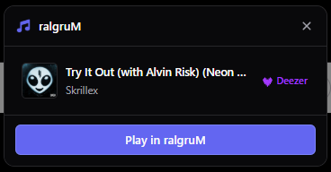
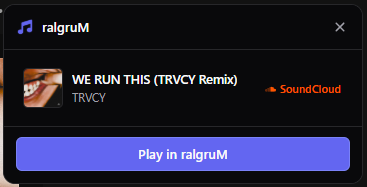

  <h1>
    
    ralgruM Browser Integration
  </h1>
  
This browser add-on connects Deezer and SoundCloud pages to the ralgruM Desktop app.

  
When you are looking at a song, album, playlist, or artist in your browser, a small toast pops up in the top-right corner.

## What it does

- Works on Deezer and SoundCloud song, album, playlist, and artist pages.
- Shows a small pop-up box with the title, artist, and cover picture.
- One click to **Play in ralgruM** (for songs) or **Open in ralgruM** (for albums, playlists, and artists).
- On song pages, you also get quick shortcuts to the album and artist when available.
- Right-click any Deezer or SoundCloud page or link and choose **Open in ralgruM**.

  
  

## Before you start

You need:

1. The **ralgruM Desktop app** installed on the same computer.
2. **Chrome** or **Firefox 142 or newer**.
3. Access to Deezer or SoundCloud in your browser, as usual.

## Set it up

### Chrome

1. Open `chrome://extensions` in Chrome.
2. Turn on **Developer mode** (switch in the top-right corner).
3. Click **Load unpacked** and choose the `extension/` folder or `dist/chrome` if you ran a build.
4. Go to a Deezer or SoundCloud song page. You should see the ralgruM box in the top-right.

### Firefox

Firefox 142 or newer is required.

1. Run `npm run build` to create the `dist/firefox` folder.
2. Open `about:debugging#/runtime/this-firefox`.
3. Click **Load Temporary Add-on** and pick the `manifest.json` file inside `dist/firefox`.
4. Go to a Deezer or SoundCloud song page. You should see the ralgruM box in the top-right.

A temporary add-on is removed when you restart Firefox.

### Connect it to the ralgruM app

Clicking **Play** or **Open** asks your computer to open the link in ralgruM.

- The first time, your browser may ask which app to use. Choose ralgruM and allow it to open these links.
- If nothing happens when you click, make sure the ralgruM desktop app is installed and up to date.

## How to use it

1. Go to a song, album, playlist, or artist on Deezer or SoundCloud.
2. Look for the small toast in the top-right corner.
3. Click **Play in ralgruM** or **Open in ralgruM**.
4. Click the **X** to dismiss the toast.

Other ways to use it:

- Right-click the page and choose **Open in ralgruM**.
- Right-click a Deezer or SoundCloud link and choose **Open link in ralgruM**.
- Click the ralgruM icon in your browser toolbar to open settings.

## Settings

Click the ralgruM toolbar icon to change when the box appears.

- **Show toast automatically** - turn the pop-up box on or off everywhere.
- **Tracks** - show it on song pages.
- **Albums and playlists** - show it on album and playlist pages.
- **Artists** - show it on artist pages.
- **Deezer / SoundCloud** - turn it on or off for each music site.

Changes apply immediately.

## Privacy

- We do not track you. There are no ads, no analytics, and no ralgruM servers collecting your browsing.
- To show the title and cover picture, the add-on reads the page you are on. If it needs more detail, it asks Deezer (`api.deezer.com`) or SoundCloud (`soundcloud.com/oembed`) for that song, album, playlist, or artist. This happens when the box is turned on, before you click anything.
- Cover pictures load from Deezer, SoundCloud, or their image hosts, like normal images in your browser.
- Your on/off settings are saved in your browser and may follow your browser account if you use browser sync. Your browsing history is not saved.
- Clicking **Play** or **Open** sends that song, album, playlist, or artist to the ralgruM app on your computer. What the app does next is up to the app.
- The music sites themselves still work exactly as before, these controls only affect the ralgruM box.

## For developers

Source layout:

- `extension/` - the add-on (background, page scripts, pop-up, settings page, icons).
- `tests/` - checks that run with plain Node.js (`npm test` needs no extra installs; lint and format need `npm install` first).
- `scripts/` - build script that creates `dist/chrome` and `dist/firefox`.

Useful commands (Node 18 or newer):

- `npm test` - run the checks.
- `npm run build` - build the Chrome and Firefox folders in `dist/`. Store-upload files (ZIPs) are created manually afterwards.
- `npm run lint` - run ESLint.
- `npm run format:check` - check formatting with Prettier (`npm run format:write` fixes it).

## License

Copyright © 2026 kekkodance. All rights reserved. See LICENSE.
